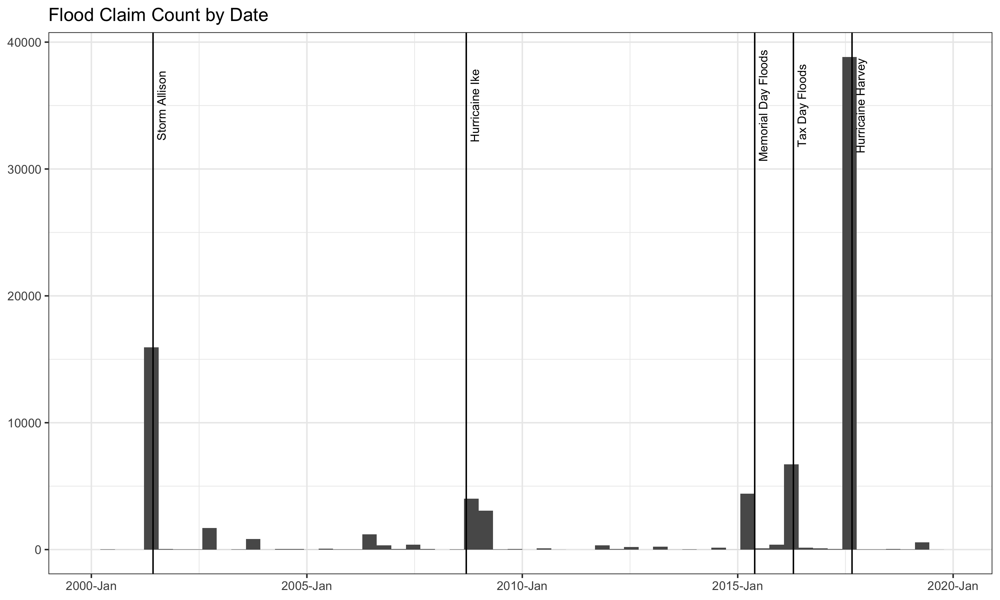
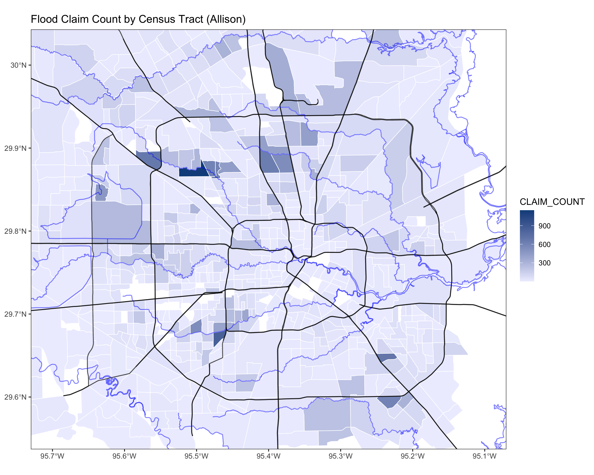
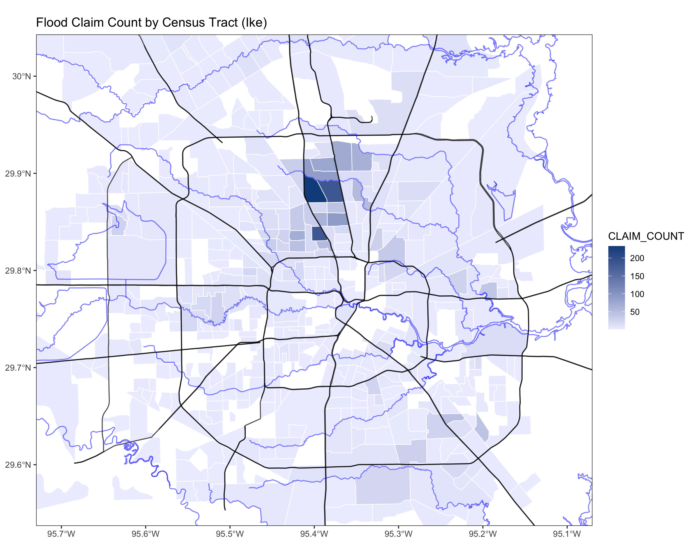
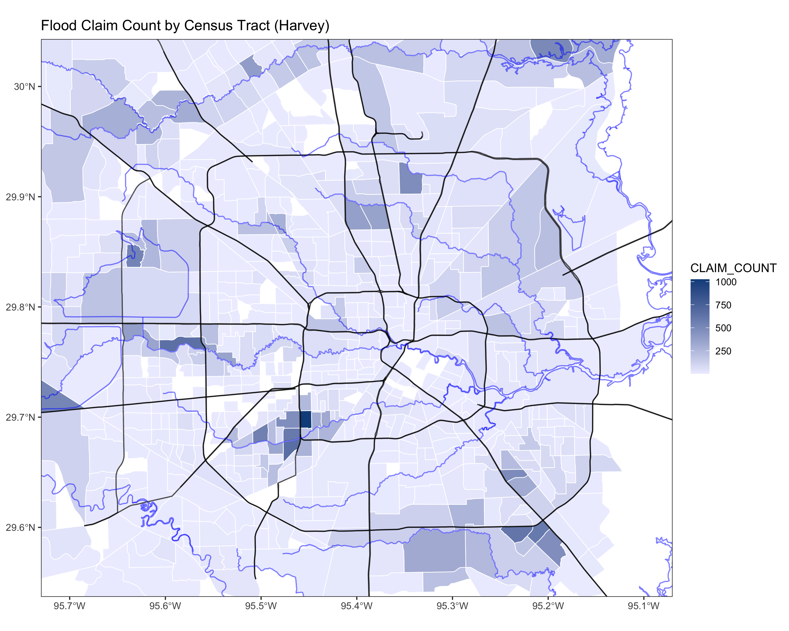

# Twenty Years of Flooding in Houston

This project explores FEMA flood claims data taken from https://www.fema.gov/media-library/assets/documents/180374.

We can see that spikes in FEMA flood claims correlate with major flood events in Houston.

 

Because FEMA provides annonymized data we can view claims by:

* Zip code
* Latitude and longitude (rounded to one decimal)
* Census Tract

Census tract is the most discrete level of detail available. We can plot claim counts by census tract for various storm events, to see which areas were hardest-hit.

 

 

 